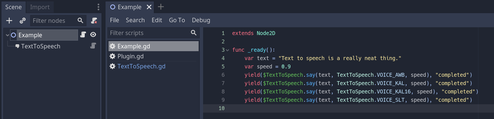

# Godot Text to Speech

Godot Text to Speech is a plugin that creates text-to-speech voice synthesis in the Godot engine using the FOSS Flite engine.

This plugin was originally developed for use in [Strange Aeons](https://store.steampowered.com/app/1290960/Strange_Aeons), a game where you chat with a neural net AI.

## Instructions

Once installed the node types **TextToSpeech**, **TextToSpeech2D** & **TextToSpeech3D** should appear in the Godot engine. Add one of them to your scene and use the example below as a guideline.

## Example

In the example project shown below the the phrase `Text to speech is a really neat thing.` is said upon launch in all the available voices.



```
extends Node2D

func _ready():
    var text = "Text to speech is a really neat thing."
    var speed = 0.9
    yield($TextToSpeech.say(text, TextToSpeech.VOICE_AWB, speed), "completed")
    yield($TextToSpeech.say(text, TextToSpeech.VOICE_KAL, speed), "completed")
    yield($TextToSpeech.say(text, TextToSpeech.VOICE_KAL16, speed), "completed")
    yield($TextToSpeech.say(text, TextToSpeech.VOICE_SLT, speed), "completed")
```

## Compilation instructions

Linux:

- Run `make` in the src directory

Windows:

- Install MinGW-w64 on your system
- Run `mingw32-make` in the src directory

## Known issues

- The current implementation is intended to have a small (optimally one) **TextToSpeech** node in the scene as the dynamic library is loaded for each instance