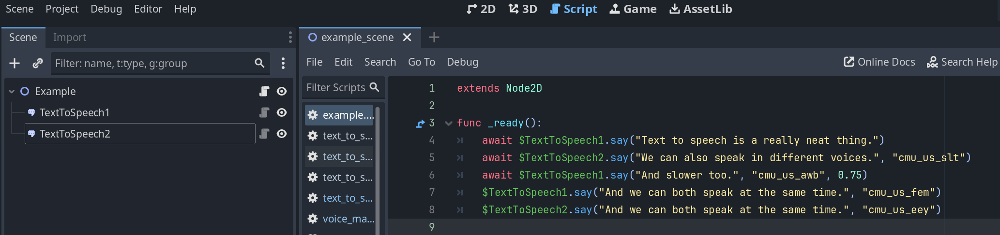

# Godot Text to Speech

Godot Text to Speech is a plugin that creates text-to-speech voice synthesis in the Godot engine using the FOSS Flite engine.

This plugin was originally developed for use in [Strange Aeons](https://store.steampowered.com/app/1290960/Strange_Aeons), a game where you chat with a neural net AI.

## Instructions

Once the plugin is installed the node types **TextToSpeech1D**, **TextToSpeech2D** & **TextToSpeech3D** should appear in the Godot engine. Add one of them to your scene and use the example below as a guideline.

## Example



```
extends Node2D

func _ready():
	await $TextToSpeech1.say("Text to speech is a really neat thing.")
	await $TextToSpeech2.say("We can also speak in different voices.", "cmu_us_slt")
	await $TextToSpeech1.say("And slower too.", "cmu_us_awb", 0.75)
	$TextToSpeech1.say("And we can both speak at the same time.", "cmu_us_fem")
	$TextToSpeech2.say("And we can both speak at the same time.", "cmu_us_eey")
```

## Keep in mind

- The current implementation is intended to have a small number of **TextToSpeech1D/2D/3D** nodes as the dynamic library and the voice file is loaded for each instance
- Voices for this text to speech plugin are located under **addons/text_to_speech/voices/**. The voices are .flitevox voices renamed to .flitevox.res to be treated by Godot as resources. Additional voices can be added to this directory and used with this plugin.
- It is a good practice to only keep the voices you use in the game, as all .flitevox.res files in the directory are shipped with the game and extracted to **user://** at runtime.

## Build prerequisites

Linux:

- sudo apt update
- sudo apt upgrade -y
- sudo apt install build-essential cmake git python3

Windows:

- Install MSYS2 https://www.msys2.org/
- run MSYS2 MINGW64
- pacman -Syu
- pacman -S mingw-w64-x86_64-gcc mingw-w64-x86_64-pkg-config mingw-w64-x86_64-cmake mingw-w64-x86_64-make mingw-w64-x86_64-python

## Build instructions

Linux:

- git submodule update --init --recursive
- mkdir -p build
- cd build
- cmake .. -DCMAKE_BUILD_TYPE=Release
- cmake --build . -j$(nproc)

Windows:

- git submodule update --init --recursive
- mkdir -p build
- cd build
- cmake .. -G "MinGW Makefiles" -DCMAKE_BUILD_TYPE=Release
- cmake --build . -j$(nproc)

The build compiles Flite from the `flite` submodule and links the resulting static libraries into the Godot GDExtension. The generated plugin library is written to `addons/text_to_speech/lib/<platform>/`.

GitHub Actions builds Linux and Windows artifacts on every push and pull request.
